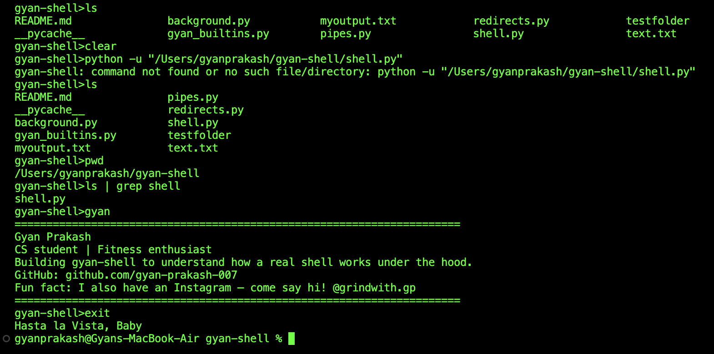
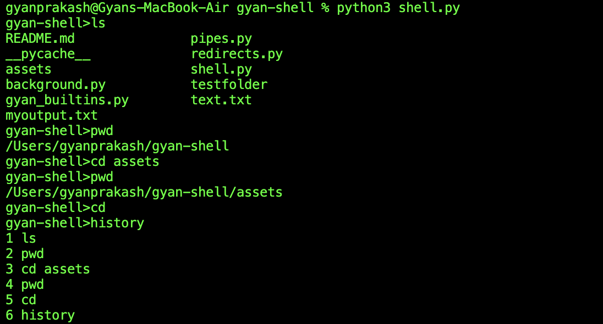
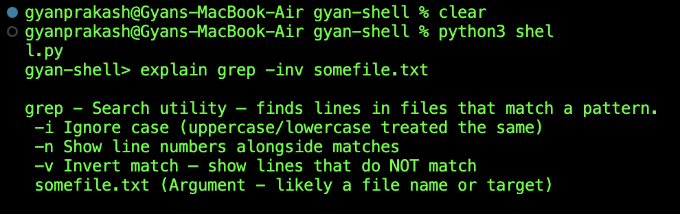

# gyan-shell

A command-line shell built from scratch in Python — supports real command execution, pipes, redirects, background processes, and a few personal touches. Built to actually understand how a shell works under the hood, instead of just using one every day without thinking about it.

## Why I built this

I use a terminal every day but never really thought about what's actually happening when I type a command and hit Enter. So I decided to build my own shell from scratch — implementing real process execution, pipes, and redirects myself — to understand how tools like Bash and Zsh actually work internally.

## Features

- **Real command execution** — runs any actual program available on your system
- **`cd` built-in** — correctly changes the shell's own working directory (a subtle OS-level detail: child processes can't change their parent's directory, so `cd` has to be handled specially)
- **Pipes (`|`)** — chain multiple commands together, e.g. `ls | grep py`
- **Redirects (`>`, `<`)** — write output to a file, or read input from a file
- **Background processes (`&`)** — run something without blocking the shell, e.g. `sleep 10 &`
- **Graceful error handling** — bad commands print a clean message instead of crashing the shell
- **Command history** — press ↑/↓ to recall previous commands, or type `history` to see a numbered list of everything you've run
- **`explain` command** — breaks down any command and its flags in plain English, e.g. `explain tar -xvzf archive.tar.gz`. A beginner-friendly alternative to reading `man` pages, backed by a growing database of common commands
- **`gyan` command** — a little personal touch that prints my info/bio

## Tech Stack

- Python 3
- `subprocess`
- `os`
- `readline`

## Platform

Developed and tested on Linux/macOS.

> Note: Some commands may behave differently on Windows due to differences in shell and process handling.

## Installation

```bash
git clone https://github.com/gyan-prakash-007/gyan-shell.git
cd gyan-shell
python3 shell.py
```

## Usage

```bash
python3 shell.py
```

Example session:

```
$ python3 shell.py

gyan-shell> ls -la
gyan-shell> ls | grep shell
gyan-shell> ls > output.txt
gyan-shell> sort < output.txt
gyan-shell> sleep 5 &
gyan-shell> cd testfolder
gyan-shell> explain tar -xvzf archive.tar.gz
gyan-shell> gyan
gyan-shell> history
gyan-shell> exit
```

## Project Structure

```
gyan-shell/
│
├── shell.py            # Main REPL loop that ties everything together
├── gyan_builtins.py     # Built-in commands (cd, exit, history, gyan)
├── gyan_explain.py       # `explain` command + command/flag database
├── pipes.py             # Pipe (|) implementation
├── redirects.py         # Input/Output redirection (<, >)
├── background.py        # Background process handling (&)
└── README.md
```

## Preview





## Skills Demonstrated

- Operating Systems fundamentals
- Process Management
- Inter-Process Communication (IPC)
- Command Parsing
- Unix Shell Concepts
- Command Documentation / Developer Tooling
- Python Systems Programming

## What I Learned

- How a shell launches programs as separate operating system processes
- Why `cd` can't work like a normal command (child processes can't change their parent's working directory)
- How Unix pipes connect one process's output stream directly to another process's input stream
- The difference between `subprocess.run()` (blocking) and `subprocess.Popen()` (non-blocking), and why background processes require the latter
- How built-in commands differ from external programs in a shell
- How to parse combined short flags (like `-xvzf`) into individual flags programmatically

## Future Improvements

- [x] Command history (↑/↓ to recall previous commands)
- [x] `explain` command with plain-English flag breakdowns
- [ ] Tab completion
- [ ] Job control (`jobs`, `fg`, `bg`, `kill`)
- [ ] Combined pipes + redirects in a single command
- [ ] Proper signal handling (Ctrl+C should stop the running command, not the whole shell)

---

Built from scratch to explore how a Unix shell works under the hood.